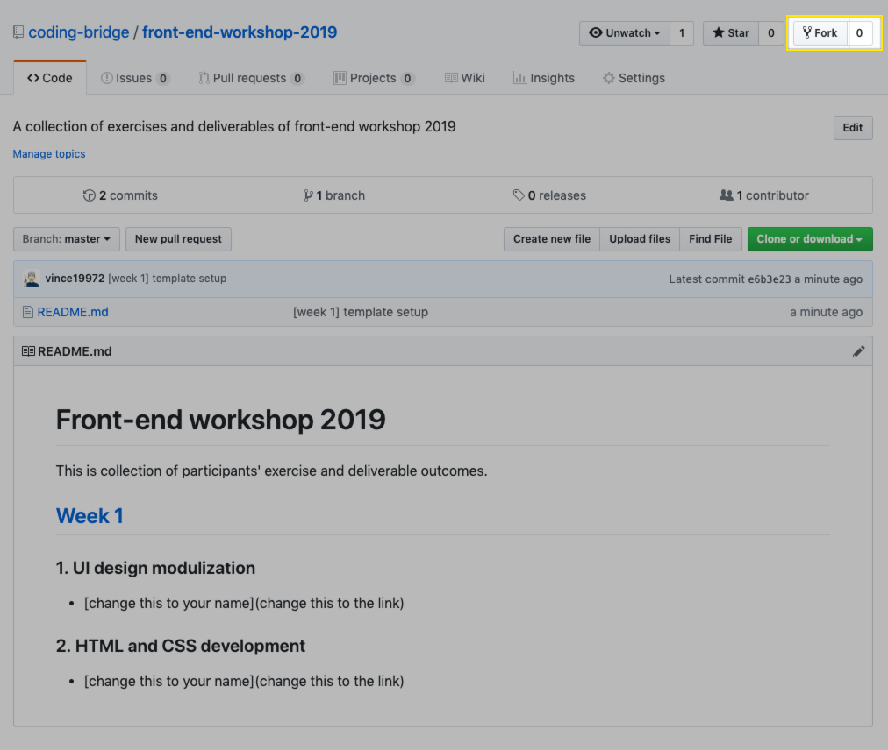

# Front-end workshop 2019

This is collection of participants' exercise and deliverable outcomes.

## Instruction

1. To deliver content, please [fork](https://guides.github.com/activities/forking/) this repo:

2. As forking completes, you should see the repo is created in your account, with indication of origin from this repo. You can edit the content by clicking pencil icon.

3. After editing, create a [pull request](https://help.github.com/en/articles/creating-a-pull-request) to submit your changes over here and wait for project admin to merge it.

## [Week 1](https://coding-bridge.github.io/workshop/#/itp-front-end/week-1/README)

### 1. UI design modulization

- [change this to your name](change this to the link)

### 2. HTML and CSS development

- [change this to your name](change this to the link)